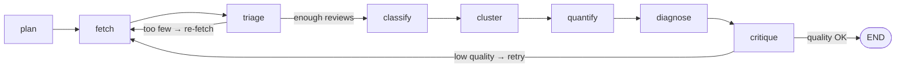

# ReviewLens

> Agentic review-intelligence pipeline for the travel eSIM category — reads public App Store reviews, classifies them by pain theme, and benchmarks your app against competitors with statistically honest confidence intervals.

[](https://github.com/mashraf-portfolio/reviewlens/actions/workflows/ci.yml)
[](LICENSE)
[](https://python.org)

**Live demo:** <!-- TODO: add Streamlit Cloud URL after deploy -->

---

## What it is

ReviewLens is a LangGraph agentic pipeline that fetches public App Store reviews for a target eSIM app and its competitors, classifies each review into a 7-theme pain taxonomy, and surfaces statistically grounded competitive differences. A Streamlit dashboard presents per-100-review rates, Wilson confidence intervals, and prioritised interventions.

---

## Architecture



8 nodes, 2 conditional edges — matches design doc §2.1.

**Node responsibilities**

| Node | Role |
|------|------|
| `plan` | Build the fetch plan: target app + competitors, storefronts |
| `fetch` | Pull App Store reviews; serve fixture corpus in offline mode |
| `triage` | Filter by recency window; route to re-fetch if corpus is too thin |
| `classify` | Label each review with theme + sentiment (Claude Haiku — high-volume) |
| `cluster` | Synthesise per-theme exemplar sentences (Claude Opus) |
| `quantify` | Compute per-100-review rates + Wilson 95% CIs with `statsmodels` |
| `diagnose` | Rank cross-company deltas; label Supported vs Directional |
| `critique` | Judge analysis quality; retry from fetch if below threshold |

---

## Tech stack

| Layer | Technology |
|-------|-----------|
| Orchestration | LangGraph |
| Judgment — cluster, critique | Claude Opus 4.8 |
| Classification — per-review | Claude Haiku 4.5 (`claude-haiku-4-5-20251001`) |
| Statistics | `statsmodels` Wilson CIs |
| Dashboard | Streamlit + Plotly |
| Data source | Apple App Store customer-review RSS JSON feed + iTunes Search API |

---

## Quick start

```bash
make install      # install deps + pre-commit hooks

make run          # fixture run (offline, no API key, no spend)
make run-ui       # launch Streamlit dashboard (reads last run results)
make run-live     # full live pipeline (requires ANTHROPIC_API_KEY in .env)
```

Copy `.env.example` to `.env` and set `ANTHROPIC_API_KEY` before running live.

---

## What it found

The completed run read **4,011 public App Store reviews** across USim and 5 competitors (Airalo, Holafly, Jetpac, Nomad, Saily) over a 12-month window.

**USim's own triaged corpus is thin — ~56 theme-instances across all categories.** This is precisely why the analysis is category-comparative rather than self-referential: the field provides the denominator and the reference distribution. Low USim volume is input data, not a tool failure.

### Supported findings (n ≥ 15 on both sides AND CIs non-overlapping)

All three are in the same cell — negative support mentions — confirming the signal is real, not a one-competitor artefact:

| Finding | USim per-100 [95% CI] | Competitor per-100 [95% CI] | Delta |
|---------|----------------------|----------------------------|-------|
| Negative support mentions vs **Airalo** (category leader) | 28.6 [18.4–41.5] n=16 | 3.1 [2.4–3.9] n=61 | **+25.5** |
| Negative support mentions vs Saily | 28.6 [18.4–41.5] n=16 | 7.4 [5.4–10.1] n=35 | +21.2 |
| Negative support mentions vs Nomad | 28.6 [18.4–41.5] n=16 | 9.4 [6.8–12.9] n=33 | +19.2 |

The primary actionable signal: **USim's negative support rate is materially and statistically higher than the category leader's.** Airalo records 3.1 negative-support mentions per-100 reviews; USim records 28.6 — a gap that survives the Wilson CI non-overlap test with both sides above the n=15 floor.

### Directional findings

Most cells are labelled Directional because USim's per-theme sample is small. **This is a feature, not a bug** — the agent refuses to over-claim when intervals are too wide to separate companies. A Directional label means the point estimate points in a direction but does not meet the evidence bar for a Supported claim.

---

## Statistical honesty

All rates are **per-100-reviews** with **95% Wilson confidence intervals** (`statsmodels.stats.proportion.proportion_confint`, method `"wilson"`).

**Why Wilson?** The Normal approximation breaks down for small counts and proportions near 0 or 1. Wilson handles both correctly without producing intervals outside [0, 1].

**Why floor = 15?** Below 15 observations per cell, Wilson intervals are too wide to separate two companies even when point estimates differ substantially. A finding is labelled **Supported** only when both sides have n ≥ 15 **and** their CIs are disjoint. Below that bar the label is **Directional** — real signal, insufficient certainty.

The `min_n_floor` is set in `config/config.yaml` and propagated into the graph state, so it is easy to tighten or loosen as USim's review volume grows.

---

## Responsible data

See [docs/responsible_data.md](docs/responsible_data.md).

---

## Screenshots

### Overview tab
<!-- TODO: add screenshot after deploy -->

### Competitive Grid tab
<!-- TODO: add screenshot after deploy -->

### Interventions tab
<!-- TODO: add screenshot after deploy -->
